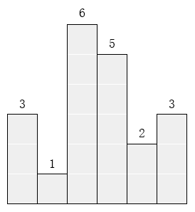
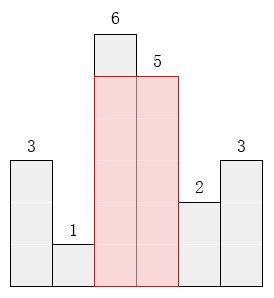

# 最大的矩形(CCF201312-3)
问题描述：

在横轴上放了n个相邻的矩形，每个矩形的宽度是1，而第i（1 ≤ i ≤ n）个矩形的高度是hi。这n个矩形构成了一个直方图。

例如，下图中六个矩形的高度就分别是3, 1, 6, 5, 2, 3。



请找出能放在给定直方图里面积最大的矩形，它的边要与坐标轴平行。对于上面给出的例子，最大矩形如下图所示的阴影部分，面积是10。



**输入格式**

第一行包含一个整数n，即矩形的数量(1 ≤ n ≤ 1000)。

第二行包含n 个整数h1, h2, … , hn，相邻的数之间由空格分隔。(1 ≤ hi ≤ 10000)。  (hi是第i个矩形的高度。)

**输出格式**

输出一行，包含一个整数，即给定直方图内的最大矩形的面积。

**样例输入**

6

3 1 6 5 2 3

**样例输出**

10


**思路**

解决这个问题有两种方法
- 一是暴力法（枚举法），任何一个矩形必然始于第i个直方图，终止于第j块直方图（i<=j），从所有这些面积中找出最大矩形面积即可；
- 二是对这n个数只看一遍，就算出最大矩形面积，其计算复杂度为O(n)，相比较而言，算法要复杂一些，还需要付出空间的代价。
- 仔细观察这两个算法有关的程序，会发现其实二者之间算法复杂度的差异很小。

简单介绍下第二种方法：
- 第二种方法是先找到一个逐步递增的面积，即如果Hi < Hi+1则最大面积是逐步递增的。这个过程中，将这些Hi放入堆栈中，直到不满足Hi < Hi+1为止。这个时候，最大的面积可能是最右边是Hi，由若干块（也可能只有１块）拼成的，从中获得一个最大的面积。出现面积非递增时，则把堆栈中比当前高的直方图弹出，重复上述过程，需要说明的是这不影响高的直方图与其右边连成一片。

方法一：
```c++
/* CCF201312-3 最大的矩形 */
 
#include <iostream>
 
using namespace std;
 
const int N = 1000;
int h[N];
 
int main()
{
    int n, ans, height, area;
 
    // 输入数据
    cin >> n;
    for(int i=0; i<n; i++)
        cin >> h[i];
 
    // 计算最大矩形面积：暴力法（枚举法）
    ans = 0;
    for(int i=0; i<n; i++) {
        height = h[i];
        for(int j=i; j<n; j++) {
            if(h[j] < height)
                height = h[j];
            area = (j - i + 1) * height;
            if(area > ans)
                ans = area;
        }
    }
 
    // 输出结果
    cout << ans << endl;
 
    return 0;
}
```
方法二：
```c++
/* CCF201312-3 最大的矩形 */
 
#include <iostream>
#include <stack>
 
using namespace std;
 
const int N = 1000;
int h[N+1];
 
int main()
{
    int n, ans=0, area, temp;
 
    // 输入数据
    cin >> n;
    for(int i=0; i<n; i++)
        cin >> h[i];
    h[n] = 0;
 
    // 计算最大矩形面积
    stack<int> s;
    for(int i=0; i<=n; i++) {
        if (s.empty() || h[s.top()] < h[i])
            s.push(i);
        else {
            temp = s.top();
            s.pop();            //弹出
            area = h[temp] * (s.empty() ? i : i - s.top() - 1);
            if (area > ans)
                ans = area;
            --i;
        }
    }
 
    // 输出结果
    cout << ans << endl;
 
    return 0;
}
```
- 这类算法有一个有效的解决思路 —— **单调栈**，如方法二
- 想要直方图矩形面积要最大的话，需要尽可能的使得连续的矩形多，并且最低一块的高度要高。有点像木桶原理一样，总是最低的那块板子决定桶的装水量。那么既然需要用单调栈来做，首先要考虑到底用递增栈，还是用递减栈来做。我们想啊，递增栈是维护递增的顺序，当遇到小于栈顶元素的数就开始处理，而递减栈正好相反，维护递减的顺序，当遇到大于栈顶元素的数开始处理。那么根据这道题的特点，我们需要按从高板子到低板子的顺序处理，先处理最高的板子，宽度为1，然后再处理旁边矮一些的板子，此时长度为2，因为之前的高板子可组成矮板子的矩形 ，因此我们需要一个**递增栈**，当遇到大的数字直接进栈，而当遇到小于栈顶元素的数字时，就要取出栈顶元素进行处理了，那取出的顺序就是从高板子到矮板子了，于是乎遇到的较小的数字只是一个触发，表示现在需要开始计算矩形面积了，为了使得最后一块板子也被处理，这里用了个小trick，在高度数组最后面加上一个0，这样原先的最后一个板子也可以被处理了。由于栈顶元素是矩形的高度，那么关键就是求出来宽度，那么跟之前那道 Trapping Rain Water 一样，单调栈中不能放高度，而是需要放坐标。由于我们先取出栈中最高的板子，那么就可以先算出长度为1的矩形面积了，然后再取下一个板子，此时根据矮板子的高度算长度为2的矩形面积，以此类推，直到数字大于栈顶元素为止，再次进栈。

总结如下：
- 单调栈其实是一个看似原理简单，但是可以变得很难的解法。线性的时间复杂度是其最大的优势，每个数字只进栈并处理一次，而解决问题的核心就在处理这块，当前数字如果破坏了单调性，就会触发处理栈顶元素的操作，而触发数字有时候是解决问题的一部分，比如在 Trapping Rain Water 中作为右边界。有时候仅仅触发作用，比如在 Largest Rectangle in Histogram 中是为了开始处理栈顶元素，如果仅作为触发，可能还需要在数组末尾增加了一个专门用于触发的数字。另外需要注意的是，虽然是递增或递减栈，但里面实际存的数字并不一定是递增或递减的，因为我们可以存坐标，而这些坐标带入数组中才会得到递增或递减的数。所以对于玩数组的题，如果相互之间关联很大，那么就可以考虑考虑单调栈能否解题。

[参考](https://www.cnblogs.com/grandyang/p/8887985.html)
# 单调栈 Monotone Stack

单调栈主要解决以下问题：
- 寻找下一个更大元素
- 寻找前一个更大元素
- 寻找下一个更小元素
- 寻找前一个更小元素
- qualified 的 窗口的 max/min
- sliding window max/min

单调栈的解题模式基本都是一样的

一般都是：

```python
for 元素 in 列表:
    while 栈不为空 and 栈顶元素（大于或者小于）目标值：
	    出栈
		根据业务处理
	入栈
```

