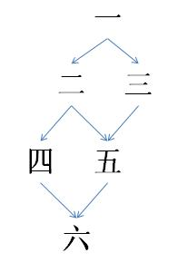
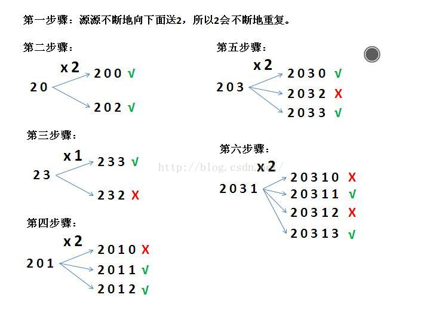

# CCF 有趣的数(201312-4)
问题描述：

我们把一个数称为有趣的，当且仅当：
1. 它的数字只包含0, 1, 2, 3，且这四个数字都出现过至少一次。
2. 所有的0都出现在所有的1之前，而所有的2都出现在所有的3之前。
3. 最高位数字不为0。

因此，符合我们定义的最小的有趣的数是2013。除此以外，4位的有趣的数还有两个：2031和2301。

请计算恰好有n位的有趣的数的个数。由于答案可能非常大，只需要输出答案除以1000000007的余数。

**输入格式**

输入只有一行，包括恰好一个正整数n (4 ≤ n ≤ 1000)。

**输出格式**

输出只有一行，包括恰好n 位的整数中有趣的数的个数除以1000000007的余数。

**样例输入**

4

**样例输出**

3 

**解题思路**

*动态规划*

前n步所有的最优解=前n-1步所有的最优解+第n步的最优解。

1. 首先考虑0、1、2、3四位的方法，不考虑四位以上。那么我可以把哪个数字放在首位呢？

- 0？首位不能是0

- 1？那么0该放哪呢？

- 2。挺合适

- 3？那么2该放哪呢？

所以我们获得了第一步骤——放2，一个数字2


2. 现在我们来接着第一步骤继续：已经成功放了2了，那么剩下0、1、3。

- 2 0？可以

- 2 3？可以

- 2 1？0该放哪里？

所以我们获得了第二步骤——放0，两个数字 2和0，以及第三步骤——放3，两个数字 2和3

3. 我们现在先研究第二步骤——放0，两个数字 2和0

- 我们现在放了2 0了，那么剩下1、3

- 2 0 1？可以

- 2 0 3？也可以

所以我们获得了第四步骤——放1，三个数字 2 0 1 ，以及第五步骤——放3 三个数字 2 0 3

 

4. 我们现在来接着研究第三步骤：放3，两个数字 2和3

- 2 3 0？可以，这是第五步骤

- 2 3 1？0该放哪里？

所以第三步骤可以和第五步骤建立联系

 

5. 我们最后研究第四步骤: 放1，三个数字 2 0 1 和 第五步骤：放3 三个数字 2 0 3

2031?刚好放完四个数字

所以我们获得了第六步骤：四个数字0123放完====================================================================

　　总结：

第一步骤：2          剩余 0 1 3

第二步骤：2 0        剩余 1 3

第三步骤：2 3        剩余 0 1

第四步骤：2 0 1      剩余 3

第五步骤：2 0 3      剩余 1

第六步骤：2 0 3 1    剩余 无

流程图如下：


建立一个二维数组a[n+1][6]，这样的话：

a[ ][ 0 ]就是一步骤

a[ ][ 1 ]就是二步骤

a[ ][ 2 ]就是三步骤

a[ ][ 3 ]就是四步骤

a[ ][ 4 ]就是五步骤

a[ ][ 5 ]就是六步骤


trick:

要让四位数变成四位数以上，而且只能用0,1,2,3，那么肯定会有重复数字。那么在六个步骤中可不可以出现重复数字呢?




状态变化如下：
```c
    status[i][0] = 1;
    status[i][1] = (status[i - 1][1] * 2 + status[i - 1][0]) % mod;
    status[i][2] = (status[i - 1][2] + status[i - 1][0]) % mod;
    status[i][3] = (status[i - 1][3] * 2 + status[i - 1][1]) % mod;
    status[i][4] = (status[i - 1][4] * 2 + status[i - 1][2] + status[i - 1][1]) % mod;
    status[i][5] = (status[i - 1][5] * 2 + status[i - 1][4] + status[i - 1][3]) % mod;
```


完整代码：
```c
#include<iostream>
using namespace std;
 
int main(){
	long mod=1000000007;
	int n,i,j;
	cin>>n;
	long long **status = new long long*[n+1];
	for(i=-1;++i<n+1;){
		status[i] = new long long[6];
		if(i==0){
			for(j=-1;++j<6;){
				status[0][j] = 0;
			}
		}
		else{
			status[i][0] = 1;
			status[i][1] = (status[i - 1][1] * 2 + status[i - 1][0]) % mod;
			status[i][2] = (status[i - 1][2] + status[i - 1][0]) % mod;
			status[i][3] = (status[i - 1][3] * 2 + status[i - 1][1]) % mod;
			status[i][4] = (status[i - 1][4] * 2 + status[i - 1][2] + status[i - 1][1]) % mod;
			status[i][5] = (status[i - 1][5] * 2 + status[i - 1][4] + status[i - 1][3]) % mod;
		}
/*		for(j=-1;++j<5;){
			cout<<status[i][j]<<" ";
		}
		cout<<status[i][j]<<endl;*/
	}
	cout<<status[n][5]<<endl;
	for(i=-1;++i<n+1;){
		delete[]status[i];
	}
	delete[]status;
	return 0;
}
```


[参考](https://blog.csdn.net/u013580497/article/details/48326879)